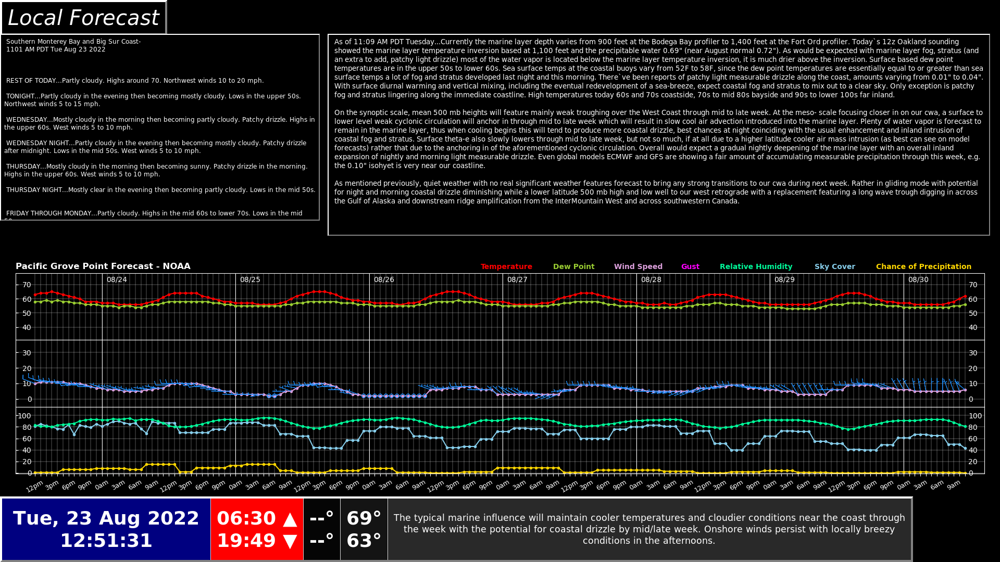
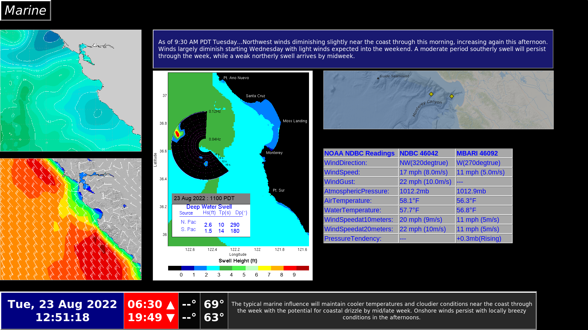
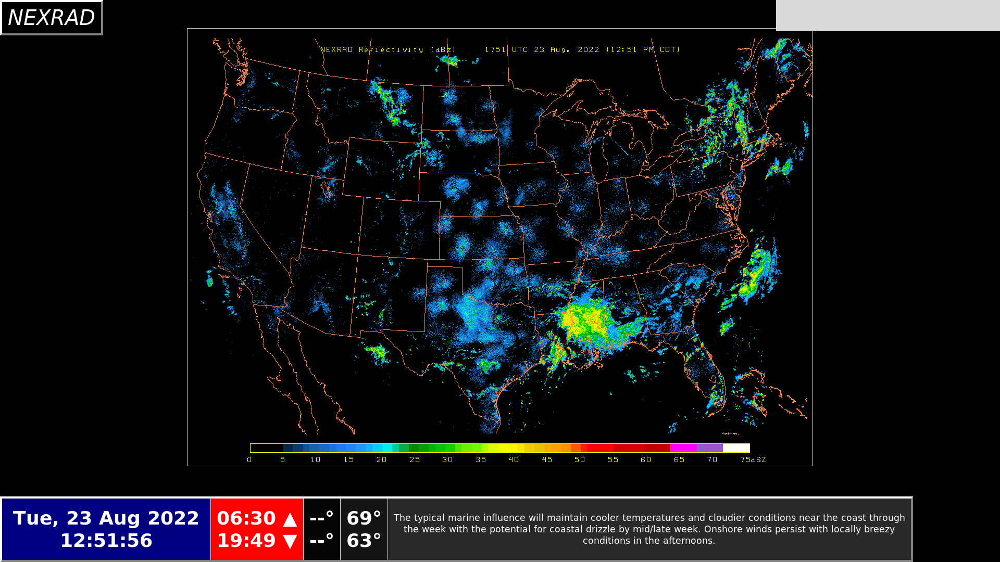
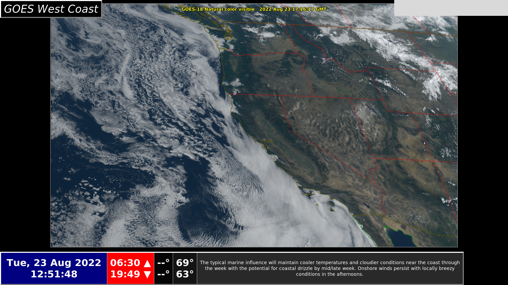
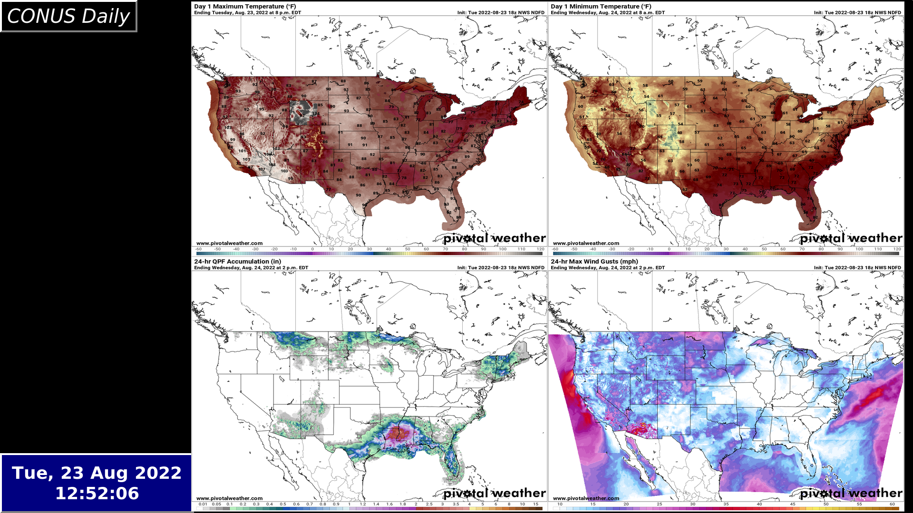
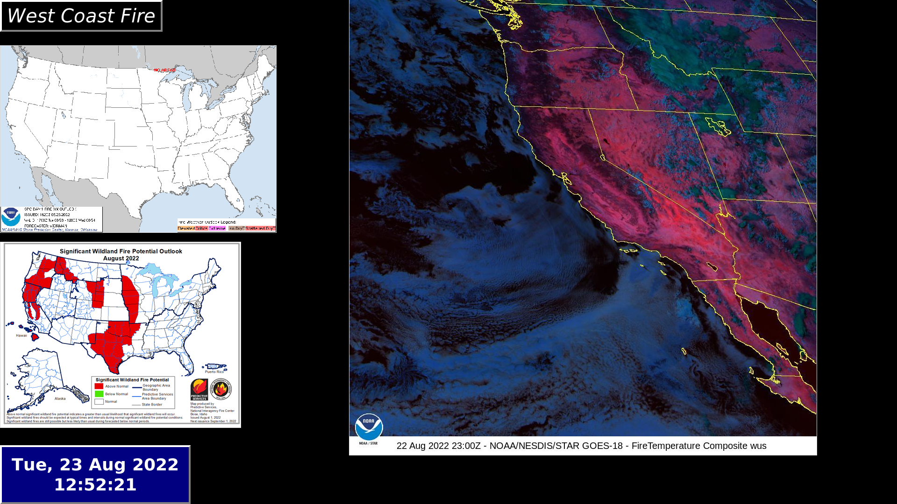
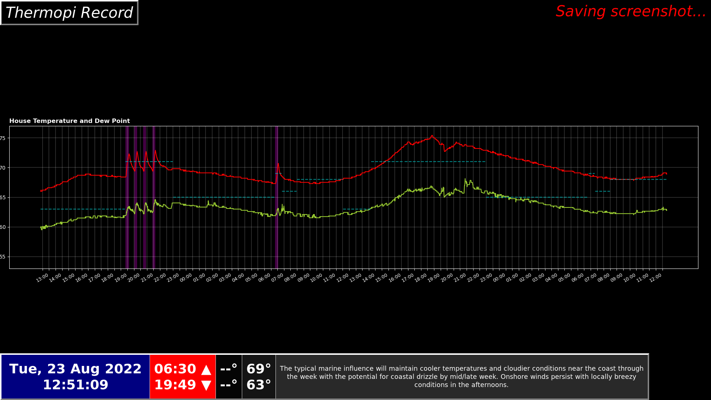

# WxFrame v1.0
 Weather Frame - Home info center for meteorology
 
 The Weather Frame is a graphic interface driven by Tkinter which presents the user with multiple pages of up-to-date meteorological data.  Images and animations of RADAR, satellite, and reanalysis data alongside textual elements inform the user of the local area weather and forecast (including marine data such as tides and swells) as well as the synoptic situation across the country and in the Pacific.  The app is meant to be shown fullscreen on a large monitor and with user commands given on a wireless numeric keypad (such as this: https://www.amazon.com/dp/B07SS9F3CK?psc=1&ref=ppx_yo2ov_dt_b_product_details), though GPIO inputs would be a possible alternative.  While intended for users with a meteorological background, the pages are customizable and more concise configurations may be selected.
 
 The WxFrame is currently only configured to be run on a 21.5 inch monitor by a user with an interest in the Monterey Peninsula and surrounding region.  Now that the first fully automated working version has been deployed, I can look at ways to make it more easily customizable and otherwise more friendly to first time users.  
 
 Soon, I hope to showcase its use so that you can actually see what I'm talking about here.
 
 ## Still to come
 
 - Exterior temperature/humidity/pressure monitoring on dashboard and graph last 48 hours with thermopi display
 - Locally-generated plots instead of choppy, resized downloads which allows greater customization better resolution (will require large data downloads!)
 - Wintertime snow conditions to be displayed seasonally on west coast fire page
 - Toggling between different meteograms in the homepage

## Screenshots

Local weather discussions and Pacific Grove meteogram.

Various model output for CA central coast, live buoy data for Monterey Bay, and NWS marine forecast discussion.

Looped animation or composite NEXRAD radar for CONUS.

Looped animation of recent GOES-18 visible imagery, zoomed to US west coast.

Pivotal Weather 24-hour forecasts for CONUS showing max/min temperatures, total precipitation, and max wind speed.

Fire outlook and animation showing last 24 hours of GOES-18 imagery in fire-sensitive band.

This page currently shows readings of interior temperature and dewpoint temperature taken from Raspberry Pi thermostat (thermopi).  Interior temperaure (red), interior dewpoint temperature (yellow), thermostat target temperature (blue dashed), furnace on (purple shading).
