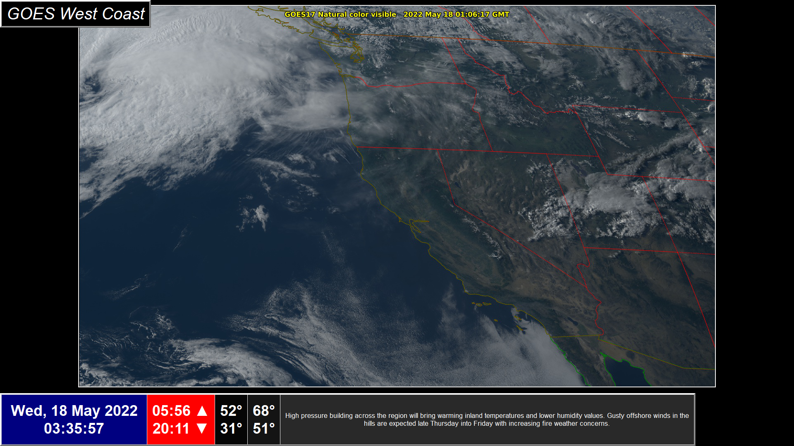

# WxFrame
 Weather Frame - Home info center for meteorology
 
 A work in progress, the Weather Frame is a graphic interface driven by Tkinter which presents the user with multiple pages of up-to-date meteorological data.  Images and animations of RADAR, satellite, and reanalysis data alongside textual elements inform the user of the local area weather and forecast (including marine data such as tides and swells) as well as the synoptic situation across the country and in the Pacific.  While intended for users with a meteorological background, the pages are customizable and more concise configurations may be selected.
 
 The WxFrame is currently only configured to be run on a 21.5 inch monitor by a user with an interest in the Monterey Peninsula and surrounding region.  The plan is to get it working before worrying too much about customizability.
 
## Features include
- a dashboard with a clock, sunrise/sunset times, current local temperatures, and the local National Weather Service forecast synopsis.
- Toggleable pages which illustrate local forecast, place-of-interest forecast, marine conditions, and synoptic conditions.

## Coming features
- run script
- thermopi integration
- improved update cycling
- multithreading for updates
- beautification

## Early progress screenshots

